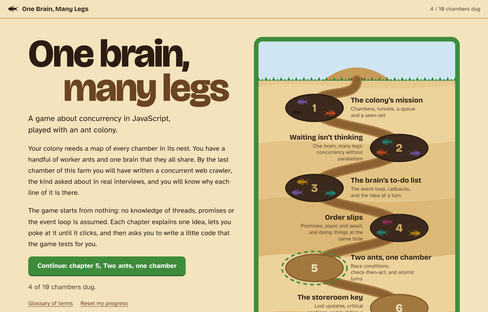
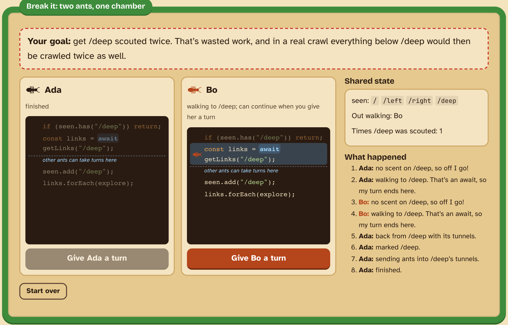
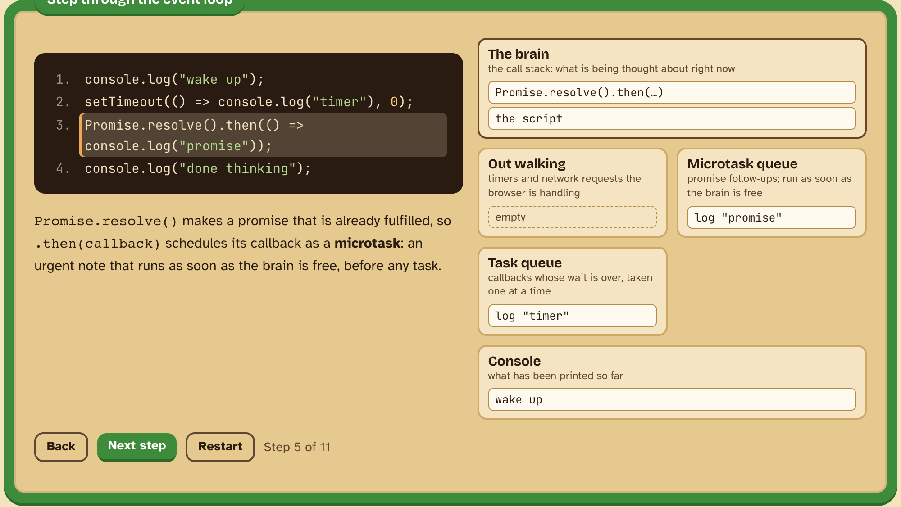
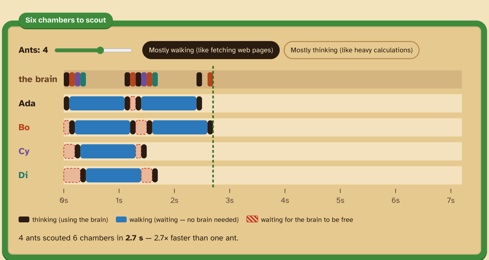
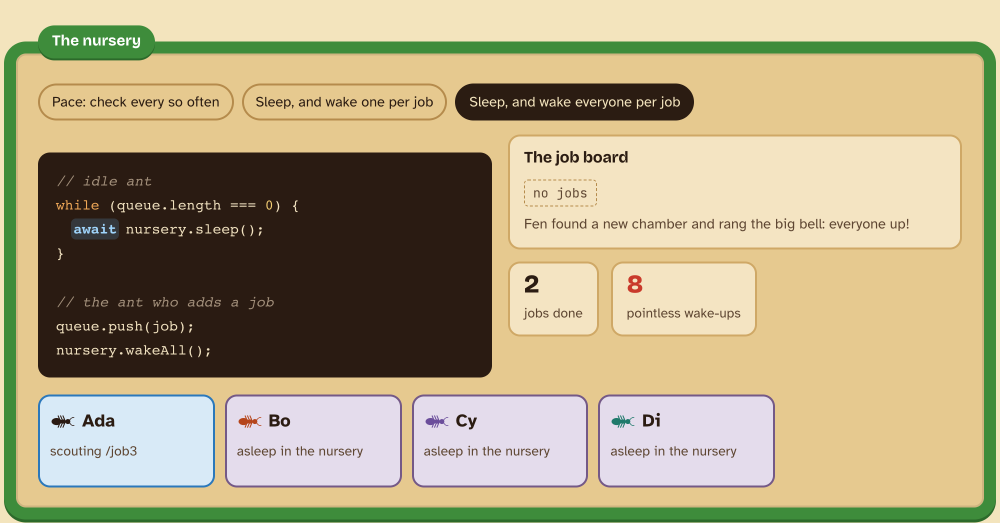
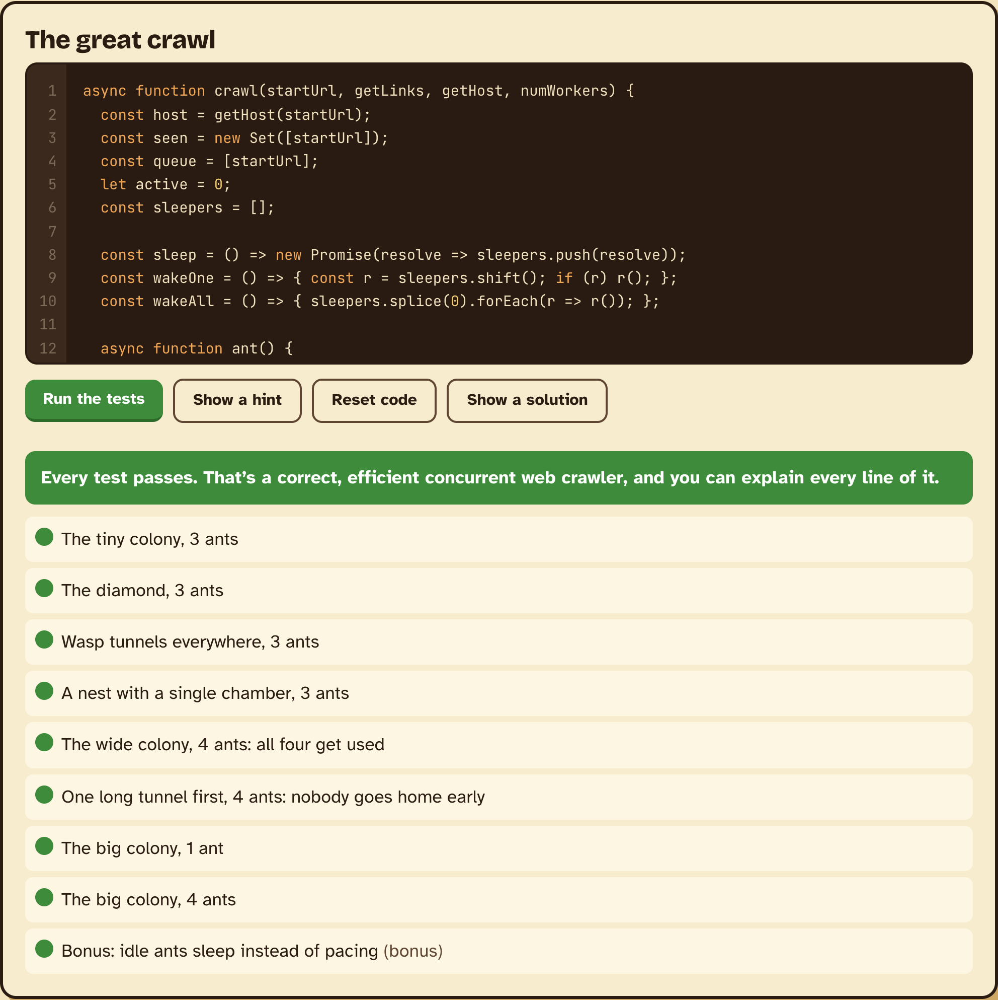
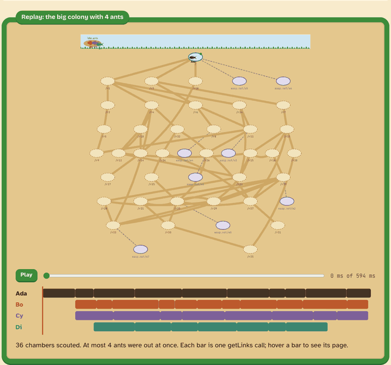
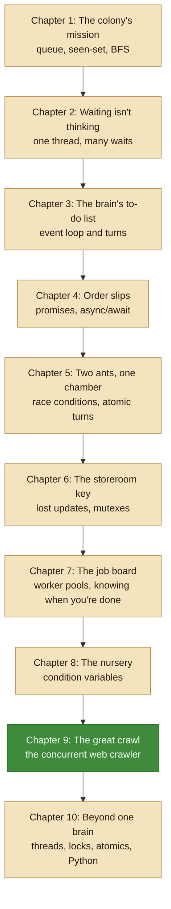

<h1 align="center">🐜 One Brain, Many Legs</h1>

<strong>A browser game that teaches concurrency in JavaScript, played with an ant colony.</strong>

  
  
  
  

  

Your colony needs a map of every chamber in its nest. You have a handful of worker ants and **one brain that they all share**, which is exactly how JavaScript works: one thread runs your code, while any number of waits happen at once. Starting from nothing, the game builds up to the concurrent web crawler asked about in real interviews, and makes sure you know why every line of it is there.

Each chapter explains one idea, lets you poke at it until it clicks, then asks you to write a little code that the game tests for you.

## Play

Open `index.html` in a browser. That's it: no install, no build, no server.

If your browser won't run the code challenges from a `file://` page, serve the folder instead with `python3 -m http.server` and visit http://localhost:8000.

Progress and the code you write are saved in your browser. "Reset my progress" on the home page clears them.

## A look inside

<table>
  <tr>
    <td width="50%" valign="top">
      
      
<strong>You are the scheduler.</strong> Decide which ant goes next and make a race condition happen with your own hands. Then try to break the fixed version, and find out why you can't.

    </td>
    <td width="50%" valign="top">
      
      
<strong>Step through the event loop.</strong> Predict what prints and in what order, then watch the call stack, timers, tasks and microtasks move one step at a time.

    </td>
  </tr>
  <tr>
    <td width="50%" valign="top">
      
      
<strong>Waiting isn't thinking.</strong> Add ants and watch the waits overlap on one shared brain. Then switch to thinking-heavy work and watch the extra ants stop helping.

    </td>
    <td width="50%" valign="top">
      
      
<strong>The nursery.</strong> Compare idle ants that keep checking the queue with ants that sleep until a bell rings. Waking every ant for each new job shows the thundering herd.

    </td>
  </tr>
</table>

### Then you write the crawler

<table>
  <tr>
    <td width="50%" valign="top">
      
      
The tests go after the classic mistakes: fetching a page twice, going over <code>numWorkers</code>, idle workers giving up while the queue is briefly empty, returning while a request is still in flight, and, for a bonus, idle workers that poll on a timer instead of sleeping.

    </td>
    <td width="50%" valign="top">
      
      
Every run ends with a replay of what your code actually did: which ant scouted which chamber, when, and how many were out at once.

    </td>
  </tr>
</table>

## The path through the colony

Every chapter adds one piece, and the last two chapters put them together.

| # | Chapter | You play | You write |
|---|---|---|---|
| 1 | The colony's mission | Scout a small colony by hand | A breadth-first crawler |
| 2 | Waiting isn't thinking | A timeline of ants sharing one brain | Quiz |
| 3 | The brain's to-do list | Predict the output, step through the event loop | Prediction puzzles |
| 4 | Order slips | One-after-another vs. all-at-once | `scoutAll` with `Promise.all` |
| 5 | Two ants, one chamber | Cause a check-then-act race | A fix for a racing crawler |
| 6 | The storeroom key | Make stored food vanish | A `Mutex` built from promises |
| 7 | The job board | Watch ants go home too early | `runPool`, a worker pool |
| 8 | The nursery | Polling vs. sleeping vs. waking everyone | A condition variable |
| 9 | The great crawl | A replay of your own crawl | The concurrent crawler |
| 10 | Beyond one brain | Break JavaScript-safe code with threads | Quiz |

The glossary inside the game (linked from the home screen) defines every term, both in the game's words and in the words interviewers use.

## How it's built

Plain HTML, CSS and JavaScript loaded as classic `<script>` tags, so the game works straight from disk.

- `js/core.js`: DOM helpers, storage, progress, syntax highlighting
- `js/graphs.js`: the colonies (small test websites) used by demos and tests
- `js/farm.js`: draws a colony and animates ants on it
- `js/widgets.js`, `js/scheduler.js`, `js/eventloop.js`: quizzes, timelines, the replay, the scheduler puzzles and the event-loop stepper
- `js/runner.js`: runs player code and tests in a Web Worker, so a stuck loop can be stopped without freezing the page
- `js/challenge.js`: the code editor and test results
- `js/chapters/`: one file per chapter
